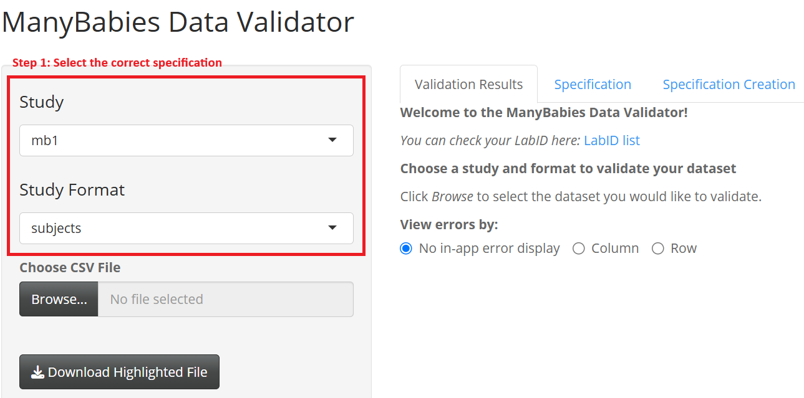
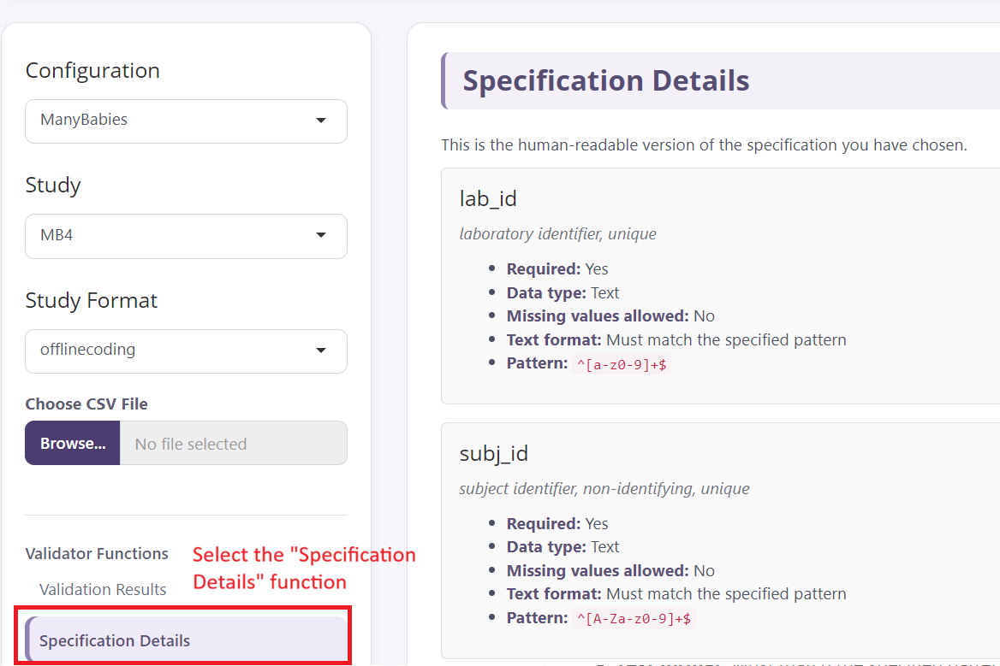
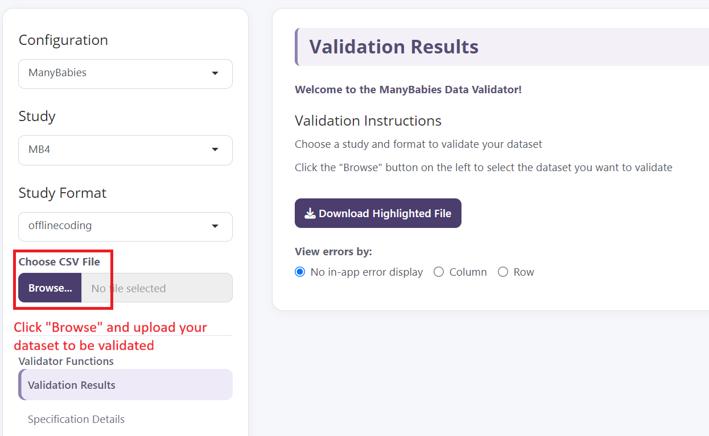
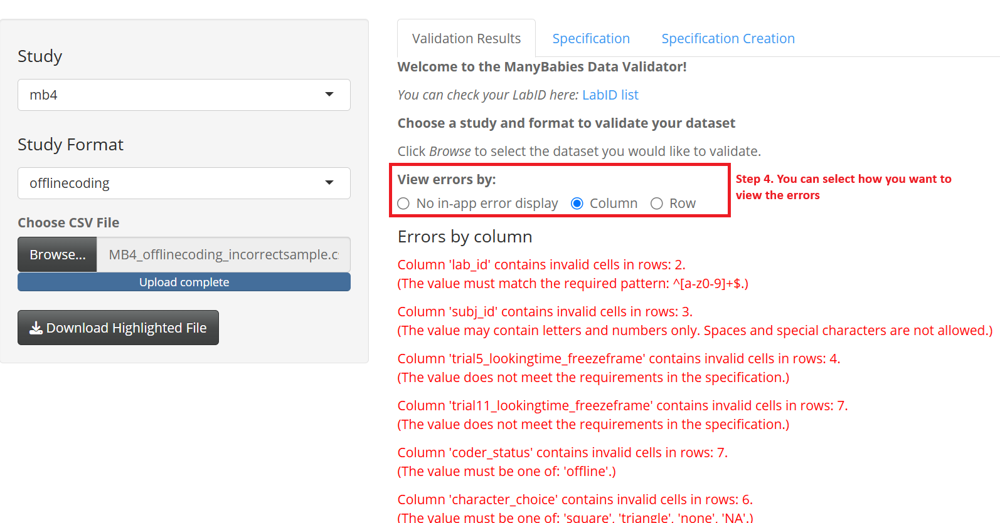
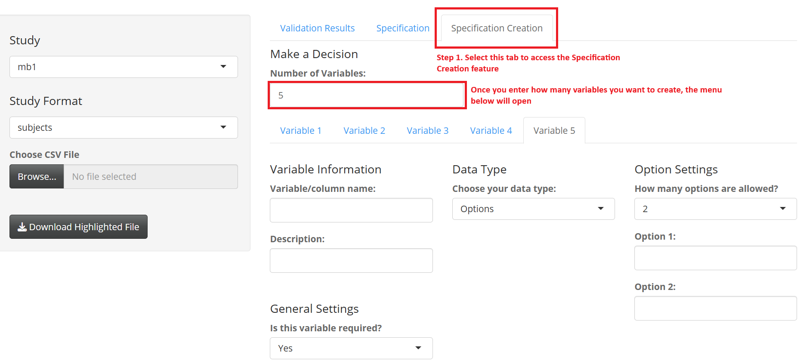
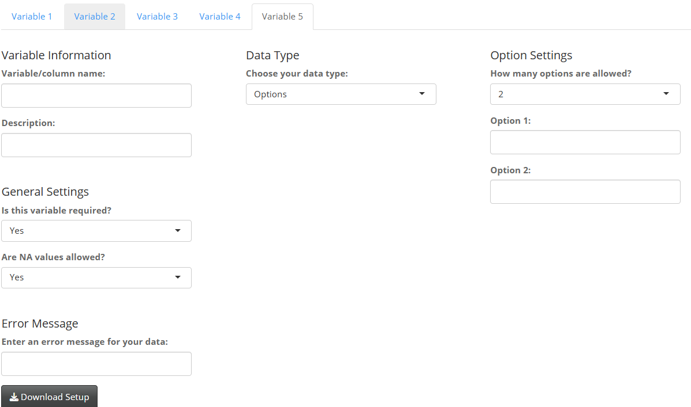

# ManyBabies Data Validator

* Currently uses [ShinyValidator]((https://github.com/manybabies/ShinyValidator) version: 2.0.1

A Shiny application for validating individual lab datasets against study-specific data specifications.

## Table of Contents
1. [User Manual: For Data Contributor](#1-user-manual---for-data-contributor)
2. [User Manual: For Project Leads](#2-user-manual---for-project-leads)
3. [User Manual: For Partner Networks](#3-user-manual-for-partner-networks)
4. [For Developers: File and Folder Structure](#4-for-developers-file-and-folder-structure)
5. [For Developers: Summary of the Recommended Workflow](#5-for-developers-summary-of-the-recommended-workflow)
6. [Contacts and Acknowledgements](#6-contacts-and-acknowledgements)

---

## 1. User Manual: For Data Contributor

This section details instructions on how to use the validator as a lab contributing data to an MB project. The data validator allows you to check whether your dataset meets the formatting and data requirements for a particular project before submitting it.

You do not need to modify any code or understand how the validator works behind the scenes (you don't even need to download R)! A live version of the validator is hosted [here](https://manybabies.shinyapps.io/validator/). Simply select the appropriate study and specification, upload your dataset, and follow the validation results.

<strong>Before you begin</strong>

Before using the validator, here are a few pre-checks you should do:

* your dataset is saved as a `.csv` file
* you know which project specification you should check against
* your column names have not been changed from those expected by the project/provided template

<strong>Step 1: Open the validator and select your project</strong>

Go to the [live version of the validator](https://manybabies.shinyapps.io/validator/). Select the study and study format that you are contributing data to from the drop-down menu on the left.

<strong>Step 2: Verify that you are using the correct specifications</strong>

Each project has its own specification that defines which variables are expected and what values or formats are permitted. Click on the Specification tab, and check that you are using the correct specifications.

<strong>Step 3: Upload your dataset</strong>

Click "Browse..." to select and upload your `.csv` dataset. The validator will compare your dataset against the selected project specification.

<strong>Step 4: Review the validation results</strong>

On the Validation Results tab, you will be able to see any errors identified by the validator. You can either view the errors by column (i.e. see which rows/observations are incorrect for given column X) or by row (i.e. see which columns are incorrect for given row/observation X). For each error, the validator will remind you of the specification for that particular column. Depending on how the specification was set up, it might not be able to pinpoint *exactly* what is wrong. Please consult your specific project manual or codebook, or contact your project lead if you are unsure what is causing the error. **Please do not ignore errors and submit datasets that did not pass validation**.

There will be a preview table of the dataset with incorrect cells highlighted.

<strong>Step 5: Correct your dataset</strong>

Use the validation results to identify and correct the errors in your original dataset. You can press the "Download Highlighted File" button to download a `.xlsx` file with these highlights to facilitate correcting your dataset. **Note: the downloaded file is in `.xlsx` format to preserve the highlights, but you must save the file as a `.csv` before trying to validate again!**

<strong>Step 6: Validate your dataset again</strong>

After making corrections, upload the revised dataset and run the validator again.

Repeat this process until your dataset passes validation.

<strong>When your dataset passes</strong>

Once the validator reports that your dataset is valid, it meets the requirements defined by the selected project specification and is ready for submission.

---

## 2. User Manual: For Project Leads

Project leads are responsible for creating and maintaining the specification that defines what a valid dataset should look like for their project.

The specification is written as a **YAML file** and contains the expected fields, data types, and validation rules for the project. Once the specification has been created, data contributors can use it to validate their datasets without needing to know the project's specific validation requirements.

**Important Note:** As of version 2.0, project leads no longer need to know how to make a `.yaml` from scratch. You can use the built-in Specification Creation feature available in the [live version of the validator](https://manybabies.shinyapps.io/validator/). This section contains instructions on using this feature.

### Creating a new specification

<strong>Step 1: Open Specification Creation</strong>

Open the **Specification Creation** feature in the application, and select how many variables you want to create. Note that you can change this later, but **decreasing the number of variables will erase part of your progress**.

<strong>Step 2: Define your variables</strong>

There are three parts you need to define: Variable Information (left), Data Type (middle), and Settings (right).

For each variable/column in your dataset, first choose and enter:

* the **Variable/column name** — the exact name of the column in the dataset
* a **Description** of the variable (optional, but useful)
* whether the field is **required**
* whether **missing values (`NA`) are allowed**
* an optional **custom error message** (you can leave this blank, and the validator will autogenerate one for you)

<strong>Step 3: Select the data type</strong>

Choose the type of validation that should be applied to the variable.

The validator supports:

* **Options** — when a variable must contain one of a predefined set of values
* **Numeric** — when a variable must contain numeric values
* **String** — when a variable contains text

Depending on the selected type, the Specification Creation feature will provide additional options for defining the validation requirements.

<strong>Step 4: Define validation requirements</strong>

Specify the restrictions that should apply to each variable.

For example, an `options` variable can be restricted to a defined set of values:

    condition
        experimental
        control

A numeric variable can be restricted by:

* minimum value
* maximum value
* whether decimals are allowed
* minimum number of decimal places
* maximum number of decimal places

A string variable can be restricted by:

* capitalization
* minimum character length
* maximum character length
* a regular expression pattern

Only specify restrictions that are appropriate for the variable. If a particular restriction does not apply, leave it unset.

<strong>Step 5: Review your specification</strong>

Before creating the specification, review the variables and validation requirements you have entered.

Pay particular attention to:

* spelling and capitalization of field names
* required fields
* whether `NA` values are allowed
* permitted option values
* numeric ranges
* decimal restrictions
* string length restrictions
* regular expression patterns

The field names in the specification must exactly match the column names expected in contributors' datasets.

<strong>Step 6: Download your specification</strong>

Once the specification is complete, press **Download Setup** to download the `.yaml` file.

**Important:** Please save your `.yaml` file following the conventional naming scheme:

    ManyBabies_project_format.yaml

For example, if you are creating a specification for the MB8 project, and the validation is for the subjects-level data, you could name it:

    ManyBabies_MB8_subjects.yaml

This naming scheme means MB8 will be listed under the "Study" dropdown, and "subjects" will be presented as an option in the "Study Format" dropdown.

<strong>Step 7: Submit your specification to the developer(s)</strong>

Before distributing the specification to data contributors, you should verify that your specification works. Please email the developer, [Francis Yuen](francis.yuen@psych.ubc.ca), the following three files:

* your project `.yaml`
* a dataset containing **only valid values**
* a dataset containing **intentional errors**, ideally ones you anticipate will be common

The developer will test your specifications and notify you when your specification is added to the live version.

---

## 3. User Manual: For Partner Networks

Partner networks can easily create custom configurations under which project-specific specifications are stored.

A **configuration** controls the application-level content and organization of the validator. This includes the application title, introductory messages, instruction sets, links, and other user-facing information.

A Network does not need to manually create the configuration YAML file. The built-in **Configuration Creation** feature can be used to create and download a configuration. Below we detail step-by-step instructions for adding your network's configuration to the validator.

### Creating a new configuration

<strong>Step 1: Open Configuration Creation</strong>

Open the **Configuration Creation** feature in the application.

This feature allows you to define the user-facing content and settings for your network's validator without manually editing a YAML file.

<strong>Step 2: Define your application information</strong>

Enter the information that should appear when users open the validator.

This includes:

* the **Application Title** — the name displayed at the top of the validator
* the **Welcome Message** — the main introductory message shown to users
* the **Secondary Message** — additional introductory information shown below the welcome message

These messages should provide users with enough information to understand what the validator is for and how they should use it.

<strong>Step 3: Define your instruction sets</strong>

The validator allows you to create two instruction sets that can be displayed to users.

For each instruction set, you can define:

* the **Instruction Set heading**
* the individual instruction lines

The headings are fully customizable. You can therefore use names that are appropriate for your network rather than using the default "Instruction Set 1" and "Instruction Set 2".

For example, a network might use:

    Before you begin
    Submitting your data

The instruction sets should contain information that contributors need to know when using the validator.

<strong>Step 4: Add useful links</strong>

You can add links that should be displayed to users of your validator.

For each link, provide:

* the **link text** — the text users will see
* the **URL** — the webpage users will be directed to

Useful links might include:

* a project website
* a data collection manual
* a codebook
* a network website
* a contact page
* other documentation relevant to data contributors

<strong>Step 5: Define the specification message</strong>

The configuration also allows you to define the message displayed alongside the selected dataset specification.

Use this area to provide additional information that users should know when viewing or selecting a specification.

For example, you might explain what the specification represents, where users can find the corresponding project documentation, or who they should contact with questions.

<strong>Step 6: Review your configuration</strong>

Before downloading your configuration, review all of the information you have entered.

Pay particular attention to:

* the application title
* welcome and secondary messages
* instruction-set headings
* instruction text
* link text and URLs
* specification-related messaging

Make sure that all information is appropriate for your network and intended audience.

<strong>Step 7: Download your configuration</strong>

Once the configuration is complete, press **Download Configuration** to download the `.yaml` file.

Your configuration should follow the naming convention:

    config_NetworkName.yaml

For example, the ManyBabies configuration is:

    config_ManyBabies.yaml

A different network might use:

    config_ManyFishes.yaml

The `config_` prefix is required so that the validator recognizes the file as a configuration.

<strong>Step 8: Submit your network's configuration file</strong>

Please email the developer, [Francis Yuen](francis.yuen@psych.ubc.ca), your network's configuration. Once the configuration has been added, it will be available for selection in the validator.

> Note: Emailing the dev is the current workflow to minimize individual network's need to interface with Git or R.

### Connecting a configuration to your specifications

Configurations and specifications work together.

The network name used in the configuration should also be used when naming the corresponding specifications (which can be created following instructions above).

For example, if your configuration is:

    config_ManyFishes.yaml

a specification for Study 1 and the subjects format could be named:

    ManyFishes_Study1_subjects.yaml

A specification for Study 2 and a trials format could be named:

    ManyFishes_Study2_trials.yaml

This naming convention allows the validator to identify which specifications belong to the selected network.

The general structure is:

    config_NetworkName.yaml

for the configuration, and:

    NetworkName_Study_Format.yaml

for the corresponding specifications.

This means that a new network can create its own configuration and collection of specifications without changing the underlying application code. Once your network's configuration is live, you may submit specifications following instructions above.

---

## 4. For Developers: File and Folder Structure

A typical ManyBabies validator project contains the following structure:

    validator/
    │
    ├── app.R
    ├── ui.R
    ├── server.R
    ├── common.R
    ├── ErrorHandler.R
    ├── sync_shinyvalidator.sh
    ├── validator.Rproj
    │
    ├── configuration/
    │   ├── config_Default.yaml
    │   ├── config_ManyBabies.yaml
    │   └── config_ManyFakes.yaml
    │
    ├── data_specifications/
    │   ├── ManyBabies_StudyA_Format1.yaml
    │   └── ManyBabies_StudyB_Format1.yaml
    │
    ├── sample_data/
    │   ├── valid_sample.csv
    │   └── intentionally_dirty_sample.csv
    │
    └── README.md

The five core R files are maintained in the base [ShinyValidator](https://github.com/manybabies/ShinyValidator) repository and synchronized to this repository using `sync_shinyvalidator.sh`.

The remaining files and folders contain ManyBabies-specific configurations, specifications, sample datasets, and documentation.

The most important distinction is:

**Configurations define how the validator behaves and what it tells the user.**

**Specifications define what the user's dataset must contain.**

This separation allows the same application code to be reused across different projects.

---

## 5. For Developers: Summary of the Recommended Workflow

For most users, creating a new validator should require little or no R programming.

For any given network's project lead, the recommended workflow is:

    1. Create a specification using Specification Creation
              ↓
    2. Download the YAML specification
              ↓
    3. Create a valid sample dataset
              ↓
    4. Create an intentionally dirty sample dataset
              ↓
    5. Send the files to the developer
              ↓
    6. Developer test the specification
              ↓
    7. Add the specification to the validator

If a given network does not have a configuration yet, they should first create, download, and submit their network-specific configuration.

### Keeping the Validator up to date

The validator uses **ShinyValidator** as its base application. The five core R files are maintained in the [ShinyValidator repository](https://github.com/manybabies/ShinyValidator):

    app.R
    ui.R
    server.R
    common.R
    ErrorHandler.R

All network-specific files, including configurations, data specifications, sample datasets, and documentation, are maintained separately.

When changes are made to the core validator in ShinyValidator, the updates can be synchronized to ManyBabies using the `sync_shinyvalidator.sh` script.

From the validator repository, run:

    bash sync_shinyvalidator.sh

The script fetches the latest version of ShinyValidator and updates only the five shared R files. It does not overwrite ManyBabies-specific configuration files, data specifications, sample datasets, or documentation.

After running the script, review the changes before committing them:

    git diff

If the changes are correct, commit and push them to the validator's repository.

This means that future changes to the validator's underlying functionality can be made in **ShinyValidator** and then transferred to the validator without manually copying files or overwriting project-specific content.

For information about the underlying application architecture, core R files, configuration system, validation functions, and development of the validator itself, please refer to the **[ShinyValidator repository](https://github.com/manybabies/ShinyValidator)**.

The **Configuration Creation** and **Specification Creation** functions are intended to handle most customization needs. Direct modification of the shared R files should generally only be necessary when adding functionality beyond the existing template.

---

## 6. Contacts and Acknowledgements

Main developer

- Francis Yuen (francis.yuen@psych.ubc.ca)

MB contacts

- Mike Frank (mcfrank@stanford.edu)
- Heidi Baumgartner(heidib@manybabies.org)

We thank Mika Braginky, Jonathan Kominsky, Christopher Green, and Abteen Arab for their work on developing the previous versions of this validator.
